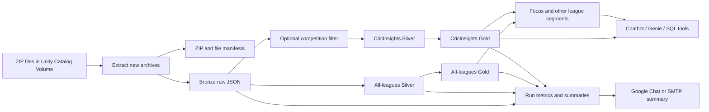

# Cricket All-Leagues AI Lakehouse

An end-to-end Databricks data engineering and AI-serving project for
Cricsheet-style cricket match data. It processes more than 22,000 JSON match
files across every competition in the source archive, preserves the complete
all-leagues dataset, and optionally publishes smaller chatbot-oriented serving
tables for selected competitions.

The project demonstrates:

- Unity Catalog and governed Volume storage
- Delta Lake tables with a bronze, silver, and gold medallion architecture
- Schema-drift-tolerant ingestion of semi-structured JSON
- Idempotent incremental processing from ZIP files
- Match, delivery, wicket, player, team, league, and season analytics
- AI-ready serving tables designed for natural-language questions
- Job orchestration, audit metrics, failure-tolerant notifications, and
  infrastructure-as-code deployment through Databricks Asset Bundles

## Business Problem

Raw cricket archives are useful for analysis but awkward for applications.
Each JSON file represents a match, nested arrays contain innings and deliveries,
and the same question may require joining match metadata, ball-by-ball events,
players, teams, competitions, seasons, and outcomes.

This lakehouse solves that problem in two layers:

1. It creates a complete, reusable all-leagues analytical foundation in
   `cricket.cricket_all`.
2. It creates compact, predictable tables in `cricket.cricinsights_src2` for
   the CricInsights chatbot, Genie, or a natural-language SQL application.

The result is a single source of truth for engineering and analytics, with a
purpose-built serving layer for interactive AI workloads.

The production extension, source acquisition design, revision semantics, DQ
contract, task graph, migration order, and data dictionary are documented in
[`docs/production_extension.md`](docs/production_extension.md),
[`docs/cleanup_report.md`](docs/cleanup_report.md), and
[`docs/data_dictionary.md`](docs/data_dictionary.md).

## Source Data and Storage

The source is stored in a Unity Catalog Volume:

```text
/Volumes/cricket/cricket_all/cricket_all_raw/extracted/*.json
```

New ZIP deliveries land here:

```text
/Volumes/cricket/cricket_all/cricket_all_raw/zips/*.zip
```

The ZIP pipeline extracts only new archives into the extracted directory. Raw
JSON is retained as text in Delta so the original record remains available for
reprocessing, debugging, and future schema evolution.

## Architecture



## Medallion Layers

### Bronze: raw and replayable

The bronze layer stores one raw match record with ingestion metadata. It is
intentionally close to the source format and remains all-leagues:

| Table | Purpose |
| --- | --- |
| `cricket.cricket_all.bronze_raw_matches` | Raw JSON text, match ID, source file, ingestion run, and source metadata |

Keeping raw JSON in bronze makes the pipeline replayable when parsing rules or
downstream models change.

### Silver: normalized analytical facts

Silver parses nested JSON into queryable Delta tables. Arrays are exploded at
the delivery and wicket grain, while match-level dimensions are retained for
filtering and joins.

| Table | Grain | Purpose |
| --- | --- | --- |
| `cricket.cricket_all.silver_matches` | One row per match | Dates, season, competition, gender, venue, teams, outcome, and match metadata |
| `cricket.cricket_all.silver_deliveries` | One row per delivery | Batter, bowler, non-striker, runs, extras, innings, over, and delivery context |
| `cricket.cricket_all.silver_wickets` | One row per wicket event | Dismissed player, dismissal kind, fielders, player credited with the wicket, and delivery context |

The same transformation code can target the optional serving schema by
changing the schema and source parameters. This keeps all-leagues and filtered
processing consistent without duplicating parsing logic.

### Gold: business and AI serving facts

Gold tables reduce the work required by dashboards, SQL users, and chat tools.
They use stable dimensions such as `league_group`, `league_name`, `gender`,
`season`, `team`, `player`, and `venue` so questions can be answered with
simple filters and aggregations.

All-leagues analytical tables:

| Table | Purpose |
| --- | --- |
| `cricket.cricket_all.gold_player_batting_stats` | Batting runs, innings, dismissals, averages, strike rates, and related player metrics |
| `cricket.cricket_all.gold_bowler_stats` | Wickets, overs, runs conceded, economy, and bowling metrics |
| `cricket.cricket_all.gold_team_match_summary` | Team innings and match scoring summaries |
| `cricket.cricket_all.gold_league_season_summary` | Competition and season rollups |

Optional AI-serving tables:

| Table | Grain | Chatbot use |
| --- | --- | --- |
| `cricket.cricinsights_src2.gold_ai_match_facts` | One row per selected match | Match lookup, venue, teams, result, season, and competition questions |
| `cricket.cricinsights_src2.gold_ai_player_cards` | Player and competition/season facts | Player comparisons, batting and bowling leaderboards, and profile answers |
| `cricket.cricinsights_src2.gold_ai_team_season_cards` | Team, competition, gender, and season | Team form, scoring, wins, and season comparisons |
| `cricket.cricinsights_src2.gold_ai_match_facts_focus_leagues` | One row per focused match | Fast access to the configured competition set |
| `cricket.cricinsights_src2.gold_ai_match_facts_other_leagues` | One row per other match | Separate access path for every non-focused competition |
| `cricket.cricinsights_src2.gold_ai_player_cards_focus_leagues` | Focused player facts | Fast questions for the configured competition set |
| `cricket.cricinsights_src2.gold_ai_player_cards_other_leagues` | Other-league player facts | Broad competition coverage outside the configured set |
| `cricket.cricinsights_src2.gold_ai_team_season_cards_focus_leagues` | Focused team-season facts | Fast team questions for the configured competition set |
| `cricket.cricinsights_src2.gold_ai_team_season_cards_other_leagues` | Other-league team-season facts | Broad team and season discovery |

The all-leagues schema is the primary source of truth. The optional serving
schema is a smaller chatbot contract for applications that need predictable,
low-latency access to a chosen set of competitions.

## Incremental Processing Design

The production job is designed to be safe to run repeatedly. It does not
reprocess the complete archive every time a new ZIP arrives.

```text
1. Discover ZIP files in the landing Volume
2. Check pipeline_zip_manifest
3. Extract only ZIPs not previously processed
4. Record extracted files in pipeline_extracted_file_manifest
5. Ingest only current-run JSON files into bronze
6. Parse only new match IDs into silver
7. Detect affected competition-season partitions
8. Refresh only affected gold partitions
9. Update optional filtered and other-league serving tables
10. Record counts and send the run summary
```

The idempotency keys are the source ZIP, extracted file, and match ID. This
prevents duplicate records when a job is retried or the same archive is
uploaded again. New data is appended, while affected analytical partitions are
refreshed so corrected or late-arriving matches can be represented correctly.

### Automatic file-arrival trigger

The incremental job monitors the ZIP landing directory:

```text
/Volumes/cricket/cricket_all/cricket_all_raw/zips/
```

It waits 60 seconds after the last file change before starting and limits
trigger events to one per minute. This allows a batch of uploaded ZIPs to settle
before one pipeline run processes them together.

The trigger responds to new files, not an overwrite of an existing filename.
Use a new ZIP name for a new arrival, or run the job manually when replacing an
existing archive. The current `dev` bundle target pauses automatic triggers
during deployment, so the trigger must be unpaused in the job's Schedules &
Triggers settings after a dev deployment. A production-mode target can keep the
trigger enabled across deployments.

## All-Leagues Coverage

The primary pipeline retains every league, format, gender, season, venue, team,
player, match, delivery, and wicket available in the source archive. No league
is discarded from the all-leagues schema because of the optional AI filter.

The `target_leagues` bundle variable controls the optional filtered serving
path. It can be configured for an IPL-only chatbot, a broader competition set,
or any other valid event names in the source data. The `_other_leagues` tables
retain the records outside that configured set, so the complete archive remains
available for analysis.

## Jobs and Orchestration

### Main incremental ZIP job

`cricket_incremental_zip_pipeline_job` is the operational job. It coordinates
extraction, manifests, all-leagues bronze/silver/gold, optional filtered
silver/gold, league segmentation, and notification tasks.

New ZIP uploads trigger this job automatically after the configured quiet
period when its file-arrival trigger is unpaused.

The same job supports an explicit bootstrap and a dry run:

```powershell
databricks bundle run cricket_incremental_zip_pipeline_job -t dev --profile jagadeeswaran --var run_mode=bootstrap
databricks bundle run cricket_incremental_zip_pipeline_job -t dev --profile jagadeeswaran --var dry_run=true
```

Bootstrap creates operational tables and source directories, downloads the
official archive/register sources, and builds the same Bronze/Silver/Gold path.
Incremental mode skips the full archive refresh and consumes only newly landed
or revised input.

The notification task runs with `ALL_DONE`, so a failed upstream task can still
produce an operational summary describing what completed and what failed.

## Observability and Run Reporting

The pipeline writes operational metadata to the all-leagues schema:

| Table | Purpose |
| --- | --- |
| `cricket.cricket_all.pipeline_zip_manifest` | ZIP-level processing state and idempotency |
| `cricket.cricket_all.pipeline_extracted_file_manifest` | File-level extraction state |
| `cricket.cricket_all.pipeline_task_metrics` | Task-level counts and timings |
| `cricket.cricket_all.pipeline_run_summaries` | One detailed record per pipeline run |
| `cricket.cricket_all.pipeline_table_run_counts` | Per-table new, old, and total counts |

Google Chat and SMTP summaries use this compact operational format:

```text
table_name | new_count | old_count | total_count
```

For bronze and silver tables, `new_count` is the current run contribution. For
gold aggregate tables, it is the increase compared with the latest audited
total. This makes a run easy to scan in a team channel and still leaves a
queryable audit trail in Delta.

## AI and Chatbot Usage

The AI layer is intentionally table-first. Chat tools should query gold tables
for normal questions and use silver delivery facts only when a ball-by-ball
explanation is required.

Example questions:

- Who scored the most runs in the IPL by season?
- Which players have the best batting strike rate in a selected competition?
- Which bowlers have the best economy rate by league and season?
- How does average team scoring vary across competitions?
- Show all matches played by a team at a specific venue.
- Explain the wickets in a specific innings from delivery-level facts.

Example query against the chatbot serving layer:

```sql
SELECT
  player,
  league_name,
  gender,
  season,
  batting_runs,
  batting_strike_rate
FROM cricket.cricinsights_src2.gold_ai_player_cards_focus_leagues
WHERE league_name = 'Indian Premier League'
ORDER BY batting_runs DESC
LIMIT 10;
```

Recommended tool surface:

1. `gold_ai_match_facts_focus_leagues` for match lookup.
2. `gold_ai_player_cards_focus_leagues` for player performance.
3. `gold_ai_team_season_cards_focus_leagues` for team and season analysis.
4. The corresponding `_other_leagues` tables for broad competition discovery.
5. Silver deliveries and wickets for detailed explanations and evidence.

## Validated Data Scale

One validated run processed the following approximate scale. Counts will grow as
new source files arrive:

| Dataset | Example count |
| --- | ---: |
| Source JSON files | 22,228 |
| Selected showcase matches | 2,746 |
| Selected showcase deliveries | 630,035 |
| Selected showcase wicket events | 32,868 |
| Selected showcase AI player cards | 7,820 |
| Selected showcase AI team-season cards | 454 |
| Selected showcase AI match facts | 2,746 |

The complete archive remains available through the all-leagues tables, while the
optional serving path publishes separate filtered and other-league tables for
chatbot access.

## Security and Configuration

No secrets belong in the repository. The Google Chat webhook and SMTP password
are read from Databricks Secrets at runtime.

Google Chat configuration uses:

- `google_chat_enabled`
- `google_chat_webhook_secret_scope`
- `google_chat_webhook_secret_key`

SMTP configuration uses:

- `summary_email_enabled`
- `summary_email_to`
- `summary_email_from`
- `smtp_host`
- `smtp_port`
- `smtp_user`
- `smtp_password_secret_scope`
- `smtp_password_secret_key`

Keep webhook URLs, passwords, access tokens, and personal credentials out of
bundle YAML, source code, notebooks, and Git history.

## Repository Structure

```text
databricks.yml                              Bundle variables and targets
resources/                                  Databricks job definitions
src/cricket_lakehouse/bronze/               Extraction and raw ingestion
src/cricket_lakehouse/silver/               Match, delivery, and wicket parsing
src/cricket_lakehouse/gold/                 Analytics and league segmentation
docs/                                       Operational and showcase documentation
tests/                                      Local configuration tests
```

The implementation is Python and Spark-based. Databricks Asset Bundles keep
job definitions, parameters, and environment configuration version-controlled
alongside the transformation code.

## Run Locally Against Databricks

Validate the bundle:

```powershell
databricks bundle validate -t dev --profile jagadeeswaran
```

Deploy it:

```powershell
databricks bundle deploy -t dev --profile jagadeeswaran
```

Run the incremental ZIP pipeline:

```powershell
databricks bundle run cricket_incremental_zip_pipeline_job -t dev --profile jagadeeswaran
```

Run local checks:

```powershell
uv run ruff check .
uv run pytest
```

## Portfolio Value

This project is a strong data engineering and AI portfolio showcase because it
connects platform design to a user-facing outcome:

- Data engineering: ingestion, parsing, incremental loading, deduplication,
  partition refresh, and Delta modeling.
- Databricks engineering: Unity Catalog Volumes, serverless jobs, Asset
  Bundles, job dependencies, and governed schemas.
- Analytics engineering: stable dimensions and reusable gold facts for league,
  player, team, venue, gender, and season questions.
- AI engineering: compact serving tables and a clear tool surface for a
  chatbot or natural-language SQL assistant.
- Production readiness: manifests, audit tables, retries, run summaries,
  secret-backed notifications, and operational count reporting.

## Further Improvements

Natural next steps include:

- Add Delta Live Tables or Lakeflow Declarative Pipelines for managed quality
  expectations.
- Add Unity Catalog row filters or views for multi-tenant chatbot access.
- Add vector search over match summaries and player narratives for semantic
  retrieval.
- Add data quality checks for schema drift, duplicate match IDs, impossible
  scores, and invalid player or team references.
- Add CI/CD validation and a deployment workflow for pull requests.
- Add a small API or Databricks App that exposes the gold tables as governed AI
  tools.

Detailed operational documentation is available in
`docs/incremental_zip_pipeline.md`, and the optional AI data product is described
in `docs/notion_cricket_showcase_lakehouse.md`.
