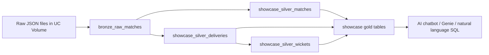

# Cricket AI Lakehouse Showcase

## Summary

This project builds a Databricks medallion lakehouse for Cricsheet-style cricket JSON files and creates an AI-ready showcase dataset for:

- Indian Premier League
- Big Bash League
- Women's Big Bash League
- The Hundred Men's Competition
- The Hundred Women's Competition

The full source volume contains 22,228 JSON files across many leagues. The showcase pipeline reuses the existing bronze raw layer and rebuilds only the filtered silver and gold layers, making the chatbot-facing tables smaller, faster, and easier to reason over.

## Source

Raw files:

```text
/Volumes/cricket/cricket_all/cricket_all_raw/extracted/*.json
```

Reusable bronze target:

```text
cricket.cricket_all
```

Focused AI showcase target:

```text
cricket.cricinsights_src2
```

## Architecture



## Why This Design

The raw JSON files have schema drift across leagues and years, so bronze stores each match as raw JSON text plus metadata. Silver parses the JSON with explicit schemas and filters early to only the selected competitions. Gold aggregates the filtered silver tables into compact, business-friendly entities for player, team, league, and match questions.

## Key Implementation Decisions

- Bronze remains all-leagues and reusable.
- Showcase silver and gold live in the dedicated `cricket.cricinsights_src2` schema.
- Silver filters before exploding deliveries, which avoids processing unnecessary leagues at ball level.
- Men and women are both included where those competitions exist in the dataset.
- `league_group`, `league_name`, `gender`, and `season` are carried into silver/gold for easy chatbot filtering.
- Serverless-incompatible Spark `persist` was removed.
- Gold joins use the full league dimensions to avoid duplicated columns and ambiguous AI query results.

## Databricks Bundle Commands

Validate:

```powershell
databricks bundle validate -t dev --profile jagadeeswaran
```

Deploy:

```powershell
databricks bundle deploy -t dev --profile jagadeeswaran
```

Run the main daily pipeline, which now includes the optional serving
layer:

```powershell
databricks bundle run cricket_incremental_zip_pipeline_job -t dev --profile jagadeeswaran
```

The standalone showcase job was retired so the project has one operational
entry point.

## Production Run Result

Showcase run:

```text
https://dbc-34677092-f2b4.cloud.databricks.com/?o=7474645124190542#job/248671586119405/run/801086955056122
```

Status: success.

## Output Tables

| Table | Rows | Purpose |
|---|---:|---|
| `silver_matches` | 2,746 | One row per selected match |
| `silver_deliveries` | 630,035 | One row per ball/delivery |
| `silver_wickets` | 32,868 | One row per wicket event |
| `gold_player_batting_stats` | 7,104 | Player batting by league, gender, season |
| `gold_bowler_stats` | 5,049 | Bowler stats by league, gender, season |
| `gold_team_match_summary` | 5,465 | Team innings/match scoring summaries |
| `gold_league_season_summary` | 55 | Competition-season rollups |
| `gold_ai_player_cards` | 7,820 | Combined batting/bowling player facts for chatbot use |
| `gold_ai_team_season_cards` | 454 | Team-season summaries for chatbot use |
| `gold_ai_match_facts` | 2,746 | Match facts for chatbot use |

## Example Chatbot Questions

- Who scored the most runs in IPL by season?
- Compare Big Bash and Women's Big Bash average team scores.
- Which players have the best batting strike rate in The Hundred women's competition?
- Which bowlers have the best economy in Big Bash by season?
- Show match facts for a specific team, venue, or season.

## Suggested AI Tool Surface

Use the gold AI tables first:

- `showcase_gold_ai_player_cards`
- `showcase_gold_ai_team_season_cards`
- `showcase_gold_ai_match_facts`
- `showcase_gold_league_season_summary`

Use silver only when the chatbot needs detailed ball-by-ball explanations.
