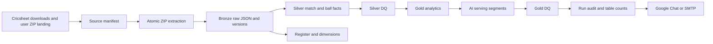
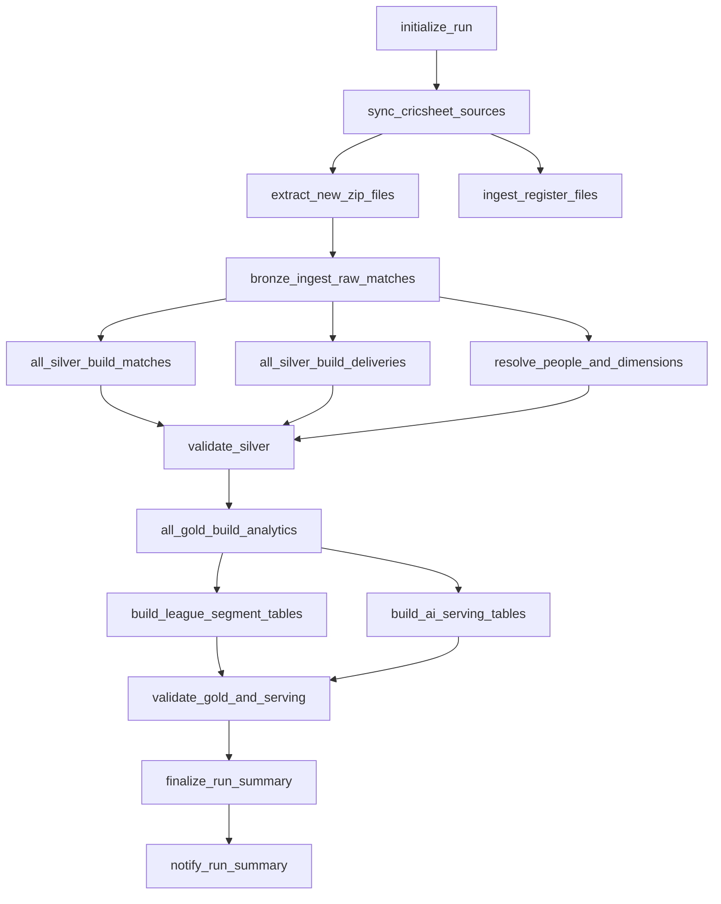

# Cricket Lakehouse Production Extension

This is the implementation guide for the extension specification. It extends
the existing `cricket-incremental-zip-pipeline` job and does not create a
competing full-load job.

## What The Project Does

The system turns Cricsheet JSON archives into an auditable, chatbot-ready
lakehouse:

1. A file-arrival event or explicit bootstrap starts the one Databricks job.
2. Source acquisition records the official archive and register files.
3. ZIP extraction is checksum-aware, staged, atomic, and traversal-safe.
4. Bronze keeps the original JSON plus source lineage and revision history.
5. Silver parses matches, deliveries, wickets, teams, venues, competitions, and
   the Cricsheet people register using explicit schemas.
6. Gold calculates reusable player, team, match, league, phase, and scorecard
   facts. AI serving splits all leagues into configured focus and other
   segments without changing source truth.
7. DQ results, counts, task audit rows, and a formatted Google Chat/SMTP summary
   are written for every run, including zero-change runs.

## Architecture



## Storage Layout

The existing trigger path remains `/Volumes/cricket/cricket_all/cricket_all_raw/zips/`.
The bootstrap/source-sync code also creates:

```text
/Volumes/cricket/cricket_all/cricket_all_raw/
  zips/{historical,incremental,register,quarantine}
  extracted/{matches,register,quarantine}
  metadata/{coverage,missing,withheld,downloads}
  checkpoints/
  logs/
```

Extracted JSON is still written to the existing `extracted` root so current raw
paths and downstream tables remain compatible. Manifests provide richer
partitioning and lineage without moving already-landed files.

## One Job, Two Modes

The only production asset is `cricket_incremental_zip_pipeline_job`.

Bootstrap an empty environment or refresh the official archive explicitly:

```powershell
databricks bundle run cricket_incremental_zip_pipeline_job -t dev --profile jagadeeswaran --var run_mode=bootstrap
```

Validate source discovery without writing extracted data:

```powershell
databricks bundle run cricket_incremental_zip_pipeline_job -t dev --profile jagadeeswaran --var dry_run=true
```

Normal file-arrival processing uses `run_mode=incremental`. It skips the full
official archive download, consumes newly landed ZIPs, and processes only new
or changed ZIP members and match revisions.

Development mode can pause automatic triggers after a deploy. Verify the job
trigger in the workspace or unpause it with the Databricks UI/CLI. Production
should use a non-development target with the file-arrival trigger enabled.

## Task Graph



## Core Tables

### Operational and source control

| Table | Grain | Purpose |
|---|---|---|
| `pipeline_run_context` | run | mode, dry-run flag, status, timestamps |
| `pipeline_source_manifest` | source version | URL, ETag, Last-Modified, length, checksum, outcome |
| `pipeline_zip_manifest` | ZIP version | checksum, extraction counts, failure/quarantine reason |
| `pipeline_extracted_file_manifest` | ZIP member | member path, CRC, file checksum, candidate match ID, revision |
| `pipeline_task_audit` | task/run | inputs, outputs, inserts, updates, skips, quarantine, errors |
| `pipeline_data_quality_results` | check/run | severity, status, failed count, sample failure |

### Bronze and history

`bronze_raw_matches` is the current latest row per match. It retains complete
`raw_json`, source path, ZIP checksum, file checksum, source revision, data
version, parse status, and ingestion run. `bronze_raw_match_versions` retains
each distinct received version so revised matches can be recomputed and audited.

### Silver

Existing `silver_matches`, `silver_deliveries`, and `silver_wickets` remain the
primary contracts. Deliveries now carry the stable key
`(match_id, innings_number, over_number, delivery_sequence)`. Wide and no-ball
deliveries are not legal balls. Wickets remain one row per wicket and run outs,
retired hurt/out, and obstructing the field are excluded from bowler credit.

New dimensions include `dim_people`, `dim_person_names`,
`bridge_person_external_ids`, `silver_player_registry`, `dim_team`,
`dim_competition`, `dim_venue`, `silver_match_teams`,
`pipeline_unresolved_people`, and `pipeline_unresolved_competitions`.

### Gold and AI serving

Existing all-league gold tables remain source truth. The AI serving schema
`cricinsights_src2` receives focus and other tables driven by `target_leagues`
or `config_focus_leagues`. League membership is determined from the parsed
event name, never from the ZIP filename.

## Incremental And Revision Semantics

- A source is downloaded only when its ETag/Last-Modified changes, or when its
  prior checksum is absent.
- A ZIP is processed only for a new checksum. A failed ZIP is never marked as
  successfully extracted.
- A member is identified by `(zip_sha256, relative_member_path)` and carries a
  file SHA256.
- An unchanged match version creates no new current row.
- A changed or higher-revision match replaces its current Bronze/Silver rows and
  remains in the versions table.
- Gold is rebuilt for affected season partitions; AI serving is regenerated from
  the resulting all-league gold facts.

## Data Quality And Notifications

Critical checks currently implemented include unique match IDs, unique delivery
keys, and non-negative delivery runs. The DQ schema is ready for reference
integrity, score reconciliation, wicket totals, legal-ball, latest-revision,
register UUID, and focus/other reconciliation checks.

`notify_run_summary` keeps the neat table format:

```text
table_name | new_count | old_count | total_count
```

It writes `pipeline_run_summaries` and `pipeline_table_run_counts`, then sends
the same summary to Google Chat or SMTP. Webhook URLs and SMTP passwords must
come from Databricks secrets.

## Source Attribution

Defaults use the official [Cricsheet downloads](https://cricsheet.org/downloads/)
and [Cricsheet register](https://cricsheet.org/register/) endpoints. The register
provides stable person identifiers and name variants; withheld matches are not
treated as downloadable input.

## Operational Commands

```powershell
databricks bundle validate -t dev --profile jagadeeswaran
databricks bundle deploy -t dev --profile jagadeeswaran
databricks bundle run cricket_incremental_zip_pipeline_job -t dev --profile jagadeeswaran
```
